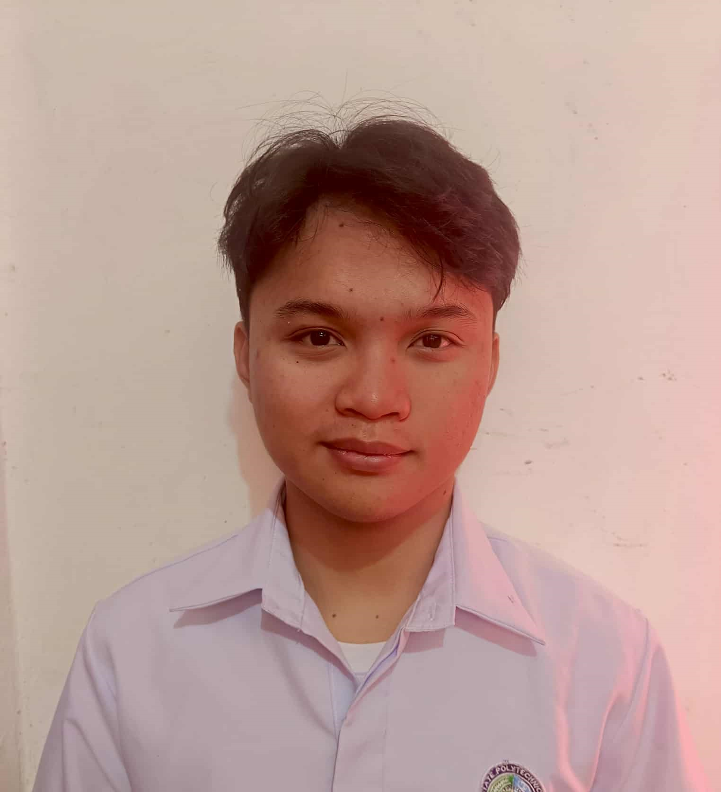

**Ervin John S. Quibedo**

> 💻 *BS Computer Science graduate looking for job opportunities to apply and grow my skills in programming and technology.  
> Eager to learn and contribute to a successful, dynamic team.*

---

## 🛠️ Skills

---

## 🎓 Thesis

### AquaSense: Chlorophyll-a Soft Sensor Model  
Developed AquaSense, a soft sensor model leveraging water quality parameters to predict chlorophyll-a levels for cost-effective water quality monitoring.

---

## 💼 Experience

### Intern – UPLB Office of Alumni Relations  
- Assisted office employees with clerical tasks  
- Supported meetings  
- Encoded alumni names into the office database  
- Updated software for computers and printers

---

## 📫 Connect with me

[LinkedIn 🔗](https://linkedin.com/in/yourprofile) | [Email 📧](mailto:your.email@example.com) | 📞 0905-284-8418

---

*Thank you for visiting my portfolio! 😊*
